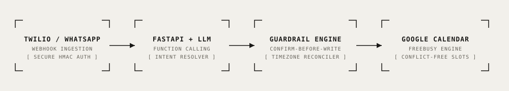

# WhatsApp & Voice AI Receptionist

<div align="center">

[](https://www.python.org/)
[](https://fastapi.tiangolo.com/)
[](https://www.twilio.com/)
[](https://developers.google.com/calendar)
[](https://openai.com/)
[](./LICENSE)
[](#offline-dry-run-verification)

**Autonomous AI receptionist for appointments and scheduling over WhatsApp and Voice, featuring cross-timezone reconciliation, Google Calendar FreeBusy resolution, and state-machine confirm-before-write guardrails.**

[Key Features](#key-features) • [Architecture](#architecture) • [Engineering Decisions](#key-engineering-decisions) • [Quick Start](#quick-start) • [Verification](#offline-dry-run-verification) • [Telemetry & Cost](#telemetry--operational-cost)

</div>

---

## Overview

In service-oriented businesses (medical clinics, wellness studios, legal consultations), customer acquisition primarily flows through WhatsApp and direct phone calls rather than static forms. 

This repository provides an enterprise-ready reference implementation of an AI receptionist capable of handling end-to-end booking workflows:
1. Understanding user availability requests via natural language.
2. Querying Google Calendar for real-time free/busy blocks.
3. Handling explicit client-to-business timezone translations.
4. Requiring strict user confirmation before committing any calendar write.
5. Emitting instant booking notifications and calendar invites.

---

## Architecture

<p align="center">
  
</p>

```
[WhatsApp / Voice Call] 
         │
         ▼
[Twilio Ingestion Webhook] ──(HMAC Signature)──► [FastAPI /webhook/whatsapp]
                                                         │
                                                         ▼
                                                 [app/agent.py]
                                                 - Intent Classification (Book / Reschedule / Cancel / FAQ)
                                                 - Structured Function Calling
                                                         │
                         ┌───────────────────────────────┴───────────────────────────────┐
                         ▼                                                               ▼
             [Confirm-Before-Write]                                           [Timezone Reconciler]
             - Staged Pending Booking State                                   - Client TZ ◄► Business TZ
             - Explicit Confirmation Prompt                                   - UTC Offset Verification
                         │                                                               │
                         └───────────────────────────────┬───────────────────────────────┘
                                                         │ (Upon explicit 'Yes')
                                                         ▼
                                            [app/calendar_tools.py]
                                            - Google Calendar API v3 (Service Account)
                                            - Conflict-Free Event Insertion & Idempotency
```

---

## Key Features

- 🕒 **Strict Timezone Reconciliation:** Never assumes the client and business share a timezone. All internal timestamps are ISO-8601 UTC-normalized while responses present explicit local offsets (`Europe/Tallinn` vs `UTC+3`).
- 🛡️ **Confirm-Before-Write State Machine:** Prevents accidental bookings by enforcing a two-phase commit: availability check → staged pending state → explicit affirmative confirmation (`yes`/`confirm`) → calendar execution.
- 📅 **Google Calendar FreeBusy Integration:** Queries live calendar availability with configurable slot durations (default: 60 min) and operating hours (09:00–18:00).
- 🔄 **Deterministic Mock Fallback:** Full offline test harness requiring zero external API keys or credentials to run dry-run simulations and unit benchmarks.
- 🎙️ **Voice Roadmap Architecture:** Modular STT/TTS abstractions (`app/voice.py`) ready for Twilio Voice `<Gather>` + Whisper + ElevenLabs integration.

---

## Key Engineering Decisions

### 1. Two-Phase Booking Confirmation
To eliminate unintended bookings caused by conversational ambiguities, the agent uses a strict staged confirmation pattern:
```
User: "11:00 works"
Agent: "To confirm: Wellness appointment on 2026-09-30 11:00-12:00 Europe/Tallinn for Anna Schmidt. Is that correct? Please reply 'Yes'."
[State: PENDING_CONFIRMATION | Slot: 2026-09-30T11:00:00+03:00]
User: "Yes, confirm"
Agent: [Executes book_slot()] -> "✅ Booking confirmed! Event ID: #mock_4"
```

### 2. Timezone Defense Matrix
Booking failures frequently stem from mismatched timezones across mobile clients and calendar servers. Every tool call explicitly logs both timezones:
```python
logger.info(
    "Function call check_availability with client_timezone=%s, calendar_timezone=%s",
    client_timezone,
    calendar_timezone
)
```

---

## Quick Start

### 1. Installation

```bash
git clone https://github.com/therealfullmetal55555/whatsapp-ai-receptionist.git
cd whatsapp-ai-receptionist
python -m venv .venv
source .venv/bin/activate
pip install -r requirements.txt
cp .env.example .env
```

### 2. Run Local Web Simulator

```bash
uvicorn app.webhook:app --host 0.0.0.0 --port 8002 --reload
```
Open `http://localhost:8002` in your browser to interact with the simulated WhatsApp chat widget.

### 3. Twilio WhatsApp Sandbox Integration

1. In the [Twilio Console](https://console.twilio.com/), navigate to **Messaging > Try it out > WhatsApp sandbox**.
2. Connect your test device by sending the join code to `+14155238886`.
3. Set your Twilio Webhook URL to:
   ```
   https://<your-ngrok-subdomain>.ngrok.app/webhook/whatsapp
   ```

---

## Offline Dry-Run Verification

The repository includes a self-contained offline verification script ([`run_tests.py`](./run_tests.py)) that validates availability queries, pending state management, confirmation transitions, and timezone tracking without requiring active Twilio or Google credentials:

```bash
python run_tests.py
```

```
=== WhatsApp AI Receptionist - Offline Test Suite ===

--- Test 1: Query Availability ---
User: Hi, I want to book wellness appointment tomorrow
Bot: I found 6 available slots for 2026-09-30 (Europe/Tallinn, your TZ: Europe/Tallinn): 09:00-10:00, 11:00-12:00... Which one works for you?
✅ Step 1 passed: Slots queried and presented

--- Test 2: Select Slot (Confirm-before-write trigger) ---
User: 11:00 works
Bot: Great! To confirm: wellness appointment on 2026-09-30 11:00-12:00 Europe/Tallinn for Anna Schmidt. Is that correct? Please confirm with yes.
✅ Step 2 passed: Pending booking created with explicit confirmation request

--- Test 3: Explicit Confirmation & Calendar Booking ---
User: Yes, confirm
Bot: ✅ Booking confirmed! Wellness appointment - Anna Schmidt on 2026-09-30T11:00:00+03:00 Europe/Tallinn. Event ID: mock_4.
✅ Step 3 passed: Booking completed and verified in calendar

--- Test 4: Timezone Safety Check ---
Session State: Client TZ=Europe/Tallinn, History count=7
✅ Step 4 passed: Timezone tracking maintained

=== ALL CRITERIA PASSED: WhatsApp Receptionist Verified (4/4) ===
```

---

## Telemetry & Operational Cost

| Component | Provider / Tier | Unit Cost | Cost per Full Dialogue |
| :--- | :--- | :--- | :--- |
| **Inbound Message Ingestion** | Twilio WhatsApp API | \$0.005 / msg | \$0.015 (3 msgs) |
| **LLM Reasoning & Extraction** | OpenAI GPT-4o-mini | \$0.15 / 1M input, \$0.60 / 1M output | ~\$0.0035 |
| **Calendar Availability & Write** | Google Calendar API v3 | Free | \$0.00 |
| **Hosting & Execution** | FastAPI on AWS / GCP | ~\$5.00 / month | <\$0.001 |
| **Total Cost per Booking Flow** | — | — | **~\$0.019** |

---

## License

This project is licensed under the [MIT License](./LICENSE) — see the LICENSE file for details.
